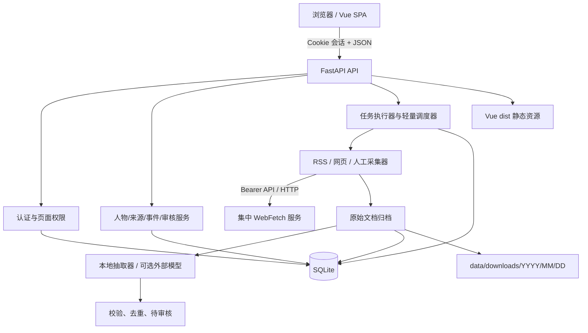
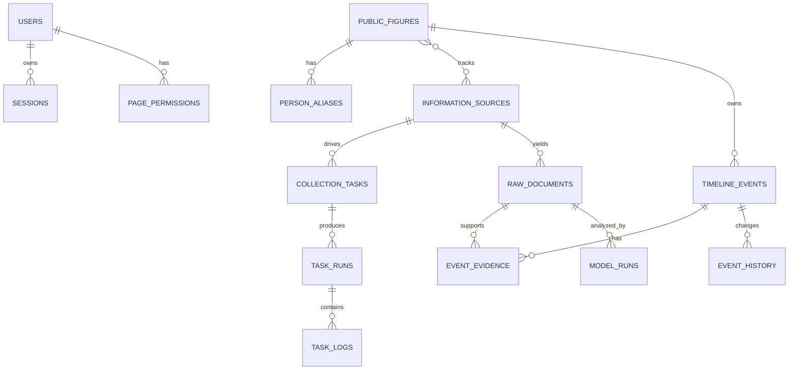

# 公开人物行程动态言论跟踪系统——系统设计说明书

> 文档版本：V1.0  
> 编制日期：2026-07-02  
> 对应需求：《软件需求规格说明书》V1.0

## 1. 设计目标

系统采用“单机可用、依赖最少、数据可追溯、外部能力可降级”的设计。默认部署在一台 Windows 或 Linux 主机上，不要求 Redis、消息队列、独立数据库或容器环境；外部大模型和地图不可用时，认证、采集、审核、时间线及运维功能仍可工作。

主要设计原则：

1. 事实、模型判断和人工判断分层保存。
2. 每个事件至少关联一条证据，未知信息不补写。
3. 采集与分析幂等，任务失败可重跑。
4. 环境信息全部配置化，敏感字段只通过环境变量引用。
5. SQLite 事务短小，单实例部署优先。
6. 浏览器仅承担展示，权限在后端强制执行。

## 2. 技术选型

| 层次 | 选型 | 设计理由 |
|---|---|---|
| 后端 | Python 3.9+、FastAPI、Uvicorn | Windows/Linux 兼容，API Schema 清晰，部署简单 |
| 数据访问 | Python `sqlite3` | 无 ORM 迁移负担，适合单机任务型写入，SQL 行为透明 |
| 数据库 | SQLite 3，WAL、外键约束 | 零服务依赖，便于备份恢复 |
| 密码 | `hashlib.scrypt` | 标准库提供、带盐、无需平台相关二进制依赖 |
| 会话 | 随机令牌 + 数据库哈希会话 | 可撤销、服务重启后有效、浏览器只保存不透明 Cookie |
| 采集 | 集中 WebFetch REST API、`xml.etree` | HTTP/浏览器抓取、缓存、重试、限流和 SSRF 由共享服务统一承担；业务系统保留 RSS 解析 |
| 分析 | 本地规则抽取 + OpenAI-compatible 可选适配器 | 未配置模型也可运行，外部模型可替换 |
| 前端 | Vue 3、Vite、原生 Fetch API | 依赖少、响应式 SPA、构建产物可由 FastAPI 静态托管 |
| 测试 | pytest、FastAPI TestClient、Vitest | 覆盖核心逻辑、API 与前端工具函数 |

生产基线支持 Python 3.9～3.13。开发文档推荐 Python 3.11/3.12，但不使用只在较新版本存在的语法。

## 3. 总体架构



### 3.1 运行进程

MVP 使用一个 Uvicorn 主进程。Web 请求和短任务在线程池中执行；轻量调度线程只负责查找到期任务并逐个触发。默认任务并发为 1，避免 SQLite 写竞争和来源压力。耗时任务未来可保持 API 不变迁移到独立 Worker。

### 3.2 降级策略

- Vue 构建产物不存在时，API 和 OpenAPI 仍可运行，根路径返回部署提示。
- 外部大模型未配置或失败时，使用本地确定性抽取，并将分析器标识写入记录。
- 地图未配置时，前端展示地点列表，不影响时间线。
- 单一来源失败只影响对应任务运行，其他来源和 Web 服务继续可用。
- 集中 WebFetch 不可用时，自动来源任务明确失败并进入既有重试/日志流程；默认不直连目标站点，人工录入仍可使用。
- FTS5 不可用时降级到参数化 `LIKE` 查询。

## 4. 代码结构

```text
src/
├── app/
│   ├── backend/
│   │   ├── main.py           # 应用装配、路由、静态托管
│   │   ├── config.py         # 配置加载、校验、脱敏
│   │   ├── database.py       # 连接、Schema、查询与事务
│   │   ├── security.py       # scrypt、会话、权限依赖
│   │   ├── collectors.py     # WebFetch 客户端、RSS 解析、直连开发降级
│   │   ├── extractor.py      # 本地/外部模型抽取与 Schema 归一
│   │   ├── services.py       # 任务执行、文档/事件写入、审计
│   │   └── scheduler.py      # 可关闭的轻量周期调度
│   └── frontend/
│       ├── src/main.js        # Vue 页面与交互
│       ├── src/styles.css     # 响应式视觉样式
│       ├── index.html
│       ├── package.json
│       └── vite.config.js
├── config/app.json
├── data/password.txt
├── JenkinsConfig/Jenkinsfile
├── tests/
├── logs/
└── requirements.txt
```

模块依赖方向为 `main -> services -> collectors/extractor/database`，配置和数据库不反向依赖 API。测试可直接替换临时数据库、密码文件及外部请求函数。

## 5. 配置设计

`config/app.json` 分为以下区域：

| 区域 | 主要配置 |
|---|---|
| `server` | host、port、base_url、trusted_proxies |
| `database` | 相对路径、busy_timeout_ms |
| `security` | session_hours、cookie_secure、login_rate_limit |
| `tasks` | scheduler_enabled、poll_seconds、max_items_per_run |
| `collector` | provider、webfetch_base_url、webfetch_api_key_env、缓存/代理策略、超时、显式直连降级开关 |
| `ai` | provider、base_url、model、api_key_env、timeout_seconds、review_threshold |
| `map` | provider、tile_url、api_key_env |
| `logging` | level、retention_days |

配置读取顺序为：代码默认值 < `app.json` < `PFTS_` 前缀环境变量。路径相对于 `src/` 解析。配置页返回值会递归屏蔽名称包含 password、secret、token、key、cookie 的字段；环境变量只显示是否已设置。

## 6. 数据库设计

### 6.1 连接策略

每个请求或任务独立获取 SQLite 连接，启用：

```sql
PRAGMA foreign_keys = ON;
PRAGMA journal_mode = WAL;
PRAGMA busy_timeout = 5000;
```

所有写入通过显式事务完成，网络请求和模型调用不放在数据库事务内。Schema 通过 `schema_version` 表顺序迁移。

### 6.2 主要关系



### 6.3 标识与时间

- 主键采用 SQLite 整数自增，便于单机索引与调试。
- API 对外仍视主键为不透明标识，不通过 ID 推断权限。
- 时间保存为 UTC ISO 8601 文本；额外保留原时区和时间精度。
- 前端统一以 `Asia/Shanghai` 显示，北京时间之外的原始时间在详情中保留。

### 6.4 幂等与去重

- 原始文档优先按 `(source_id, canonical_url)` 唯一，其次按内容 SHA-256 查重。
- 任务运行具有随机 `correlation_id`，运行中任务由数据库状态防重复。
- 事件采用人物、类型、日期、归一标题生成去重键；命中时追加证据，不覆盖人工字段。
- 同一文档重复分析会复用既有文档，并记录新的 `model_runs` 版本。

## 7. 认证与授权设计

1. 启动和每次登录前同步 `data/password.txt`。
2. 文件每行格式为 `username:password:role`，注释与空行忽略。
3. 新用户写入带随机盐的 scrypt 哈希；密码变化时更新哈希并撤销旧会话。
4. 登录成功生成 256 位随机令牌，数据库只保存 SHA-256，浏览器保存 HttpOnly Cookie。
5. 管理员固定拥有所有页面；普通用户通过 `page_permissions` 判断。
6. 路由使用 `require_page(page_key)` 二次校验，不能通过手工 API 调用越权。
7. 登录失败以“用户名 + 来源 IP”计数，达到阈值后在窗口期内拒绝尝试。

## 8. 采集设计

### 8.1 RSS

支持 RSS 2.0 和 Atom 常用字段。RSS 网络请求通过 WebFetch `/v1/fetch` 的 `http` 模式完成，业务系统再解析条目；每条保留链接、标题、发布时间和清洗后的描述。单次最多处理配置规定的条数。

### 8.2 普通网页

网页采集器调用 WebFetch `/v1/fetch` 的 `auto` 模式，允许集中服务按挑战页、状态码和选择器自动从 HTTP 升级到 Playwright；成功后使用 artifact 调用 `/v1/extract` 的 `generic.article` 适配器。若统一正文适配器失败但抓取正文存在，PFTS 才使用本地 HTML 清洗作为解析降级，不重新直连目标站点。

发布日期按“结构化提取结果、正文中的完整日期时间、文章 URL 日期路径”依次回退。事件证据明确包含完整年月日时按北京时间日历日保存；只有“月/日”或没有可靠日期时继承原始文档的完整发布时间，避免以应用运行年份补全历史日期。继承带时分的发布时间时保留精确时间，只有日历日时标记为日级精度。数据库 V3 迁移会将旧算法生成的“当前年份事件、但证据文档属于更早年份”的未人工锁定记录自动恢复为文档发布时间。

正文处理采用通用清洗管线：HTML 结构提取后，以文章标题定位正文起点，识别新闻电头并移除其前方工具栏，按责编、版权、相关阅读等标记截断页尾。站点专用规则只作为通用规则无法处理特定 DOM 结构时的补充，不替代通用模块。

事件去重键由人物、事件类型、发生日期和归一化核心事实组成。归一化会移除通讯社/报社电头、记者署名、重复日期及标点差异；不同转载来源命中同一事件时不新增时间线条目，而是追加到该事件的证据链。

在精确去重之后，系统还会在同人物、同类型、相差不超过一天的候选事件中比较核心文本相似度。达到阈值的媒体改写稿归并到主事件，并保留每篇原始文档为独立证据，以便详情页展示不同信息源。

### 8.3 人工材料

管理员提交标题、正文、发布时间、人物和可选原始 URL。系统将操作者作为来源证据的一部分，随后走与自动文档一致的分析流程。

### 8.4 URL 安全

PFTS 在调用前只接受 HTTP/HTTPS 且拒绝 URL 内嵌凭证。DNS、逐跳重定向、私网/保留地址、响应大小和敏感请求头等安全检查由集中 WebFetch 统一执行。PFTS 的直连抓取仅作为显式开启的开发降级，继续执行本地 SSRF 校验，生产默认关闭。

### 8.5 集中服务认证与追踪

WebFetch API Key 仅从 `collector.webfetch_api_key_env` 指向的环境变量读取，不写入代码、`app.json`、数据库或日志。每次抓取把服务返回的 `request_id`、`artifact_id`、实际策略、缓存命中、抓取时间和 attempts 保存到原始文档 `fetch_metadata_json`，便于跨系统追踪。既有 SQLite 在初始化时通过兼容迁移增加该字段。

### 8.6 网站自动发现

“网站（自动发现）”在数据库中沿用 `web_page` 类型，通过 `parser_config.discovery_enabled` 区分，避免破坏既有 SQLite 类型约束。任务执行前读取来源关联人物的姓名与别名作为发现词：

1. WebFetch 以 `auto` 模式抓取网站入口并保存 artifact。
2. `generic.links` 提取链接，规范化后仅保留相同主机的 HTTP/HTTPS URL。
3. 链接文字或 URL 命中人物发现词时加入文章候选。
4. 新闻、政务、时政、列表等导航页可在配置层级内继续扫描；`.html` 等文章页不会作为导航页盲目扩展。
5. 候选文章经 `generic.article` 提取后再次检查标题和正文是否包含人物发现词，通过后才入库分析。

默认最多扫描 12 个页面、深入一层栏目，允许范围为 1～50 页、0～2 层。同站判断覆盖机构主域及子域，并允许为站点配置关联域；已知站点可使用站内搜索入口补充首页不可达的历史内容。每次运行记录扫描页数、链接数、候选数、抓取数、命中数及错误摘要，零命中以警告日志呈现而非伪装成有效采集。

信息源删除采用软删除：设置 `deleted_at`、停用来源及关联任务，历史文档和事件继续保留。初始化时为既有 SQLite 自动增加 `information_sources.deleted_at`。

## 9. 分析与审核设计

### 9.1 本地抽取器

本地抽取器使用人物姓名/别名确认相关性，并以句中首要行动或发言主体确定人物归属，避免把“以某人论述为指导”等被引述人物误判为事件主体。抽取器以关键词区分行程和言论，从事件句及相邻活动句读取明确公开地点；同篇材料同一人物同时存在言论和“其他”时保留言论。无法确定的时间和坐标保持为空。

### 9.2 外部模型适配器

外部适配器使用 OpenAI-compatible Chat Completions JSON 请求，但配置中不绑定供应商。输入包含人物、别名、来源元数据、正文和严格 JSON 输出约束。响应经过类型、枚举、范围、证据包含关系校验；错误后降级本地抽取。

### 9.3 置信度与审核

基础置信度由来源等级、人物命中、时间/地点完整度、证据长度和多源数量组合得到。低于阈值、状态为 `rumored/disputed` 或缺少支撑字段的事件进入 `needs_review`。管理员通过、驳回或修改后写入历史；`human_locked=1` 的字段不会被重分析覆盖。

## 10. API 设计

API 前缀为 `/api/v1`，统一错误结构：

```json
{
  "error": {"code": "VALIDATION_ERROR", "message": "可读提示"},
  "request_id": "..."
}
```

资源分组：

- 认证：`/auth/login`、`/auth/logout`、`/auth/me`
- 人物：`/persons`
- 来源：`/sources`、`/sources/{id}/test`
- 任务：`/tasks`、`/tasks/{id}/run`、`/task-runs`
- 文档：`/documents`、`/documents/manual`、`/documents/{id}/reanalyze`
- 事件：`/events`、`/events/{id}`、`/events/{id}/review`
- 搜索与展示：`/search`、`/dashboard/summary`
- 管理：`/users`、`/permissions`、`/config/effective`、`/audit-logs`
- 运维：`/health/live`、`/health/ready`

列表响应统一为 `{items, total, page, page_size}`。排序字段采用后端允许名单，所有 SQL 参数化。

## 11. 前端设计

Vue SPA 使用一个轻量 API 客户端和组合式状态，不引入组件库。主要布局为左侧导航、顶部状态栏和内容区；窄屏转换为横向导航。

视觉规则：

- 行程、言论、其他分别使用蓝、橙、灰色标签。
- 预计、存疑、有争议除颜色外必须显示文字。
- 时间线卡片首屏展示摘要和证据来源名称，证据原文在详情展开。
- 管理页面采用表格 + 原生对话框/表单，减少依赖。
- 地图配置缺失时呈现按地点聚合的兼容视图。
- 地图使用 Leaflet 渲染配置化瓦片；只展示公开报道行程的城市级或更粗坐标，不推断实时位置和路线。无坐标行程继续以地点卡片展示。

前端不保存密码，不把会话写入 localStorage；所有请求使用同源 Cookie。收到 401 时回到登录页，403 显示权限提示。

## 12. 日志、错误与可观测性

- Python `TimedRotatingFileHandler` 写入 `logs/app.log`，每天轮转。
- 中间件生成 `X-Request-ID`；任务使用 `correlation_id` 串联任务日志。
- 外部请求错误只记录目标主机、状态码和错误类型，不记录凭证或完整敏感 URL。
- 任务运行记录计数：发现、新增、重复、事件、失败。
- 审计日志覆盖认证、用户权限、人物、来源、任务运行和事件审核。

## 13. 备份与恢复

备份脚本使用 Python SQLite Backup API 生成一致性数据库副本，同时复制配置、密码定义和下载目录。恢复前停止服务，校验目标目录，并保留当前数据的回滚副本。MVP 文档提供手工命令；自动轮转备份作为后续增强。

## 14. 部署与持续集成

### 14.1 本机部署

启动脚本执行：创建 `.venv`（若不存在）→ 安装缺失依赖 → 初始化目录/配置 → 构建前端（若 Node 可用且尚无 dist）→ 启动 Uvicorn → 写入 PID。状态和停止脚本只操作项目自身 PID。

### 14.2 Jenkins

Jenkinsfile 放在 `src/JenkinsConfig/Jenkinsfile`，轮询 SCM 由 Jenkins 任务配置；流水线执行测试、前端构建，再通过项目脚本停止旧服务和启动新版本。部署目录和仓库 URL使用参数/环境变量，不写入业务代码。

### 14.3 质量门禁

流水线至少执行：

1. Python 依赖安装。
2. 后端 pytest。
3. 前端 `npm ci`、单元测试和生产构建。
4. 配置文件 JSON 校验。
5. 启动后健康检查和核心 API 冒烟测试。

## 15. 测试设计

| 层次 | 重点 |
|---|---|
| 单元 | 配置覆盖/脱敏、密码哈希、时间转换、URL 安全、RSS 解析、本地抽取、去重键 |
| 集成 | Schema 初始化、用户同步、会话、CRUD、任务运行、文档到事件证据链 |
| API | 401/403、分页筛选、输入校验、人工审核、配置脱敏 |
| 前端 | API 错误、北京时间格式、状态标签、筛选参数 |
| 冒烟 | 启动→登录→建人物/来源→录入材料→分析→审核→时间线→停止 |

测试使用临时目录和独立 SQLite，不读取或覆盖真实 `data/`。外部网络、模型和地图全部模拟，保证离线可重复。

## 16. 关键取舍

1. **不用 PostgreSQL**：当前单机规模下 SQLite 更易部署和备份；达到多实例写入或持续锁竞争门槛后再迁移。
2. **不用 Celery/Redis**：MVP 默认任务并发 1，数据库运行记录足够；减少两个常驻服务。
3. **不用 JWT**：数据库会话可立即撤销，更适合内部管理系统。
4. **不用重型爬虫框架**：MVP 来源类型有限，标准库可覆盖；复杂站点通过后续适配器扩展。
5. **不强制外部模型**：系统先保证证据链和人工工作流，模型是可替换的增强能力。
6. **不伪造实时地图**：只展示公开证据支持的位置与精度，保护人物安全并降低误导。
