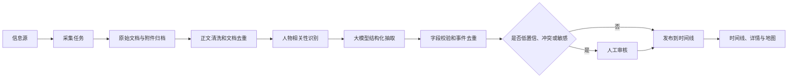

# 公开人物行程动态言论跟踪系统——软件需求规格说明书

> 文档版本：V1.0  
> 文档状态：初稿基线  
> 编制日期：2026-06-29  
> 项目代号：PFTS（Public Figures Tracking System）

## 1. 文档目的

本文档定义“公开人物行程动态言论跟踪系统”的产品范围、业务规则、功能需求、数据需求、接口约束、非功能需求和验收标准，作为后续系统设计、开发、测试、部署和验收的共同依据。

文档中的“必须”表示 MVP 验收所需能力；“应当”表示优先实现但允许在不影响主流程时延期；“可以”表示增强项。

## 2. 产品概述

### 2.1 建设目标

系统面向对公开人物公开活动进行研究、整理和回溯的用户，从管理员配置的信息源中持续收集公开材料，借助规则和大语言模型提取人物的行程、动态和言论，保留可核验的来源证据，并以统一时间线、详情页和地图等方式展示。

系统需要解决以下问题：

1. 信息分散在新闻、官方网站、公开社交账号、RSS 等不同来源，人工收集成本高。
2. 同一事件被多家媒体重复报道，时间、地点和措辞可能不一致。
3. 预测行程、已确认计划、实际发生事件和媒体推测容易混淆。
4. 模型生成的摘要若脱离原文，难以判断其可靠性。
5. 用户难以按人物、日期、类型、主题、地点和可信度快速回溯信息。

### 2.2 产品定位

本系统是“公开信息聚合、结构化与分析工具”，不是实时定位、私人活动侦察或投资建议系统。

系统只处理合法公开的信息，不采集非公开定位数据、私人住址、私人联系方式、受限账号内容或通过规避访问控制取得的数据。对尚未发生的行程必须显著标识其确认状态和来源；对来源冲突、模型无法确定或涉及敏感位置的信息，应降低精度或进入人工审核。

### 2.3 参考产品启示

“Jensen Huang's Footsteps”参考站点将公开报道中的预计访问地、日期、确认状态、地图路线、新闻与关联市场信息组合展示，并明确声明行程基于报道推测。PFTS 借鉴其“地图 + 时间信息 + 状态标识 + 来源说明”的表达方式，但扩展为多人物、多来源、可回溯证据的通用系统；MVP 不包含证券行情和投资分析。

参考资料：

- [Jensen Huang's Footsteps 站点](https://junresearch.com/jensenHuangKRTracker)
- [相关产品报道与功能说明](https://www.khan.co.kr/en/article/202606021828107/)

## 3. 范围与假设

### 3.1 MVP 范围

MVP 必须包含：

1. 登录、用户与页面权限管理。
2. 公开人物及其别名管理。
3. 信息源管理，至少支持 RSS、普通公开网页和人工录入三类来源。
4. 采集任务、任务运行记录、任务日志和手工重跑。
5. 原始文档保存、正文抽取、内容指纹去重和附件归档。
6. 使用大语言模型进行结构化抽取，并保留模型、提示词版本、证据片段和置信度。
7. 事件去重合并、冲突标记和人工审核。
8. 行程、言论、其他相关事实统一时间线。
9. 时间线必须分别支持按发生状态和审核状态筛选，筛选项与事件卡片标签保持一致。
9. 人物详情、事件详情、全文检索与组合筛选。
10. 有坐标事件的地图展示。
11. 系统配置展示、敏感配置脱敏、日志与审计记录。
12. 单元测试、集成测试和冒烟测试。

### 3.2 后续增强范围

以下能力不作为 MVP 验收阻塞项：

- 邮件、Webhook、企业微信等订阅通知。
- 每日/每周人物简报及跨人物比较。
- 图片 OCR、音视频转写和说话人识别。
- 事件与公司、政策、证券行情等外部指标的关联分析。
- 多语言全文翻译、知识图谱和语义检索。
- 面向匿名访客的公开门户。
- PostgreSQL、对象存储和多节点任务执行。

### 3.3 明确不在范围内

- 绕过登录、验证码、付费墙、反爬措施或网站访问控制。
- 抓取私人账号、泄露数据、设备位置、航班旅客数据等非公开信息。
- 推断或预测公开报道未给出的私人实时位置。
- 自动发布未经人工审核的诽谤性、指控性或高风险结论。
- 证券交易建议、自动交易和收益承诺。

### 3.4 当前假设

1. 系统首先作为个人或小团队内部工具部署，默认所有业务页面均需登录。
2. 初期人物数量不超过 100，活跃信息源不超过 300，每日新增原始文档不超过 10,000 条。
3. 服务以单实例运行，采集和分析任务可在同一主机的后台进程中执行。
4. 默认显示语言为简体中文，原文和原始语言必须保留。
5. 默认时区为 `Asia/Shanghai`；原始时间及时区信息不得丢失。
6. 大模型服务、地图服务及代理均通过配置接入，不绑定特定供应商。

## 4. 术语与核心概念

| 术语 | 定义 |
|---|---|
| 公开人物 | 因公共职务、商业、文化、体育等活动而受到公众关注，且本系统仅跟踪其公开活动的人物 |
| 信息源 | 被管理员授权配置的 RSS、公开网页、官方账号页面或人工材料入口 |
| 原始文档 | 系统从信息源取得且尚未被结构化的文章、帖子、公告或人工材料 |
| 时间线事件 | 与人物相关的结构化记录，类型为“行程”“言论”或“其他” |
| 行程 | 人物在某时间前往、出席或计划出席某地点/活动的信息 |
| 言论 | 可归因于人物的直接引语、公开表态、演讲观点或书面声明 |
| 其他 | 与人物明确相关、但无法归入行程或言论的公开事实 |
| 证据 | 支撑事件字段的来源链接、来源标题、发布时间、原文片段和定位信息 |
| 确认状态 | 对事件是否确定及是否发生的标识，不等同于模型置信度 |
| 置信度 | 系统对结构化字段与证据一致性的评分，取值 0～1 |
| 规范事件 | 对多篇重复报道进行归并后用于展示的主事件 |

## 5. 用户角色与权限

### 5.1 角色

| 角色 | 权限说明 |
|---|---|
| 管理员（admin） | 拥有全部页面和操作权限，可管理用户、页面权限、人物、来源、任务、配置及审核数据 |
| 普通用户（user） | 默认可查看仪表盘、人物、时间线、地图、搜索及事件详情；具体可见页面由管理员配置 |

匿名用户只能访问登录页和健康检查接口。系统可以在后续版本增加只读访客角色，但不得削弱现有访问控制。

### 5.2 页面权限矩阵

| 页面/功能 | 管理员 | 普通用户默认权限 |
|---|---:|---:|
| 仪表盘 | 读 | 读 |
| 人物列表与人物详情 | 读写 | 读 |
| 时间线、地图、搜索、事件详情 | 读写 | 读 |
| 审核中心 | 读写 | 无 |
| 信息源管理 | 读写 | 无 |
| 任务中心 | 读写 | 无 |
| 用户与权限管理 | 读写 | 无 |
| 系统配置 | 读写/脱敏查看 | 无 |
| 审计日志 | 读 | 无 |

管理员必须能够为每个普通用户配置可访问页面。后端必须对每个受保护 API 做权限校验，不能只依赖前端隐藏菜单。

## 6. 业务流程

### 6.1 信息处理主流程



### 6.2 状态模型

事件确认状态必须使用以下枚举之一：

| 状态 | 含义 | 展示要求 |
|---|---|---|
| `rumored` 存疑 | 单一非权威来源或存在明显不确定措辞 | 显著显示“存疑”，默认不作为确定事实统计 |
| `expected` 预计 | 媒体报道的未来安排，尚无权威确认 | 显示“预计”，不得使用“将”作无条件表述 |
| `confirmed` 已确认 | 官方或多源可靠证据确认的未来安排 | 显示“已确认”及确认来源 |
| `ongoing` 进行中 | 可靠公开来源表明事件正在发生 | 显示数据更新时间 |
| `completed` 已发生 | 有可靠证据表明事件已经发生 | 可进入历史统计 |
| `cancelled` 已取消 | 原计划已被可靠来源宣布取消 | 保留原计划及取消证据，不物理删除 |
| `disputed` 有争议 | 可靠来源之间存在无法自动消解的冲突 | 显示冲突说明并进入审核 |

事件审核状态为 `pending`（待审核）、`approved`（已通过）、`rejected`（已驳回）、`needs_review`（需复核）。审核状态与确认状态相互独立。

## 7. 功能需求

### 7.1 登录与会话

- **FR-AUTH-001** 系统必须提供用户名和密码登录功能。
- **FR-AUTH-002** 系统必须从 `data/password.txt` 读取用户定义，并在应用启动或用户登录时将新增/变更用户同步到数据库。
- **FR-AUTH-003** 数据库只允许保存密码哈希，不得保存明文密码；日志不得记录密码、会话令牌或完整认证头。
- **FR-AUTH-004** 登录成功后必须创建有有效期的安全会话；退出登录后会话立即失效。
- **FR-AUTH-005** 连续登录失败必须受到速率限制，并写入安全审计日志。
- **FR-AUTH-006** 默认账号来自通用规范，首次部署后界面必须提示管理员修改默认密码。
- **FR-AUTH-007** 未认证或无权限访问 API 时，后端必须分别返回 401 或 403。

### 7.2 用户与页面权限管理

- **FR-USER-001** 管理员必须能够查看用户、角色、状态、最后登录时间和可访问页面。
- **FR-USER-002** 管理员必须能够启用/禁用用户，并为普通用户配置页面访问权限。
- **FR-USER-003** `admin` 角色始终拥有全部页面权限，不能因误配置失去系统管理能力。
- **FR-USER-004** 用户、角色或权限变化必须写入审计日志。

### 7.3 公开人物管理

- **FR-PERSON-001** 管理员必须能够新增、编辑、启用、停用公开人物。
- **FR-PERSON-002** 人物字段至少包含姓名、原文名、别名、头像、身份简介、所属组织、职位、国家/地区、默认语言、跟踪起止时间、备注和状态。
- **FR-PERSON-003** 一个人物可以拥有多个跨语言别名；采集相关性判断必须使用姓名与已启用别名。
- **FR-PERSON-004** 人物停用后停止新采集，但历史原始文档和事件继续可查。
- **FR-PERSON-005** 人物详情必须展示简介、统计摘要、最近事件和完整时间线入口。
- **FR-PERSON-006** 删除已有关联数据的人物时必须采用软删除或拒绝删除，不得级联物理删除证据。

### 7.4 信息源管理

- **FR-SOURCE-001** 管理员必须能够新增、编辑、测试、启用、停用和软删除信息源；软删除后停止关联任务，但保留历史原始文档、事件和证据。
- **FR-SOURCE-002** MVP 至少支持 `rss`、`web_page`、`manual` 三种来源类型；接口型来源可作为相同抽象的扩展。
- **FR-SOURCE-003** 来源字段至少包含名称、类型、入口 URL、所属机构、语言、目标人物、可信等级、采集周期、解析规则、请求超时、启用状态和备注。
- **FR-SOURCE-004** 凭证、Cookie、代理密码等敏感参数不得明文显示在页面或写入普通日志，应通过环境变量或独立密钥引用配置。
- **FR-SOURCE-005** “测试来源”必须返回连通性、HTTP 状态、内容类型、解析条数、耗时和错误摘要，但测试本身不得创建正式事件。
- **FR-SOURCE-006** 系统必须支持每个来源配置合理的请求频率、超时和重试上限，并尊重适用的网站条款和抓取约束。
- **FR-SOURCE-007** 每条原始文档必须能追溯到来源；人工录入必须记录操作者。
- **FR-SOURCE-008** RSS 和网页的网络抓取必须优先调用统一配置的集中 WebFetch 服务；业务系统负责来源配置、RSS 解析和数据入库。服务地址与 API Key 必须配置化，API Key 只允许从环境变量或密钥管理读取。集中服务不可用时默认将任务标记失败并按任务策略重试，不得静默绕过集中限流和安全策略直接访问目标站点。
- **FR-SOURCE-009** 系统必须支持“网站自动发现”来源：管理员仅配置网站入口、关联人物、最大扫描页数和最大站内层级；系统通过 WebFetch 获取同域链接，以人物姓名和别名筛选候选资讯，再逐篇抓取和分析。发现过程必须限制同域、页数、层级、候选条数并排除静态文件、外域及重复 URL。
- **FR-SOURCE-010** 网站自动发现必须支持同一机构的子域或明确关联域，并可对适配站点使用站内搜索；任务必须记录发现统计，来源可访问但零命中时必须产生可见警告。

### 7.5 任务中心

- **FR-TASK-001** 系统必须展示任务定义列表，包括任务名称、类型、关联来源/人物、计划周期、启用状态、最近运行状态和下次运行时间。
- **FR-TASK-002** 管理员必须能够立即运行、启停任务，并查看每次运行记录。
- **FR-TASK-003** 任务状态至少包括 `pending`、`running`、`success`、`partial_success`、`failed`、`cancelled`。
- **FR-TASK-004** 每次运行必须记录开始/结束时间、耗时、发现数、新增数、重复数、抽取事件数、失败数、错误摘要和日志。
- **FR-TASK-005** 同一任务达到并发锁条件时不得重复运行；异常退出后锁必须可超时恢复。
- **FR-TASK-006** 失败任务应按配置进行有限次数、指数退避重试；超过上限后明确标记失败，不得无限重试。
- **FR-TASK-007** 管理员可以对指定原始文档或时间范围重新解析、重新抽取，但重跑必须幂等并保留版本记录。
- **FR-TASK-008** 管理员可以请求取消正在执行的任务；系统应在安全检查点停止并记录取消原因。

### 7.6 原始文档与附件

- **FR-DOC-001** 系统必须保存原始文档的来源 URL、规范 URL、标题、作者、来源发布时间、采集时间、原始语言、正文、内容摘要哈希和采集状态。
- **FR-DOC-002** 系统必须优先以规范 URL 去重，并结合正文哈希识别转载、URL 参数变化和重复抓取。
- **FR-DOC-003** 原始正文与结构化事件必须分离保存；重新抽取不能覆盖原始证据。
- **FR-DOC-004** 需要下载的网页快照、图片、PDF 等文件必须按 `data/downloads/YYYY/MM/DD/` 归档，并在数据库保存相对路径、文件哈希、MIME 类型和大小。
- **FR-DOC-005** 文件下载必须限制允许类型和大小，使用服务端生成的文件名，阻止路径穿越和可执行文件被直接运行。
- **FR-DOC-006** 来源内容更新时必须保留版本或变更哈希，不能静默篡改已引用的证据。
- **FR-DOC-007** 对因权限、删除或网络问题无法再次访问的原文，事件详情仍应显示既有证据元数据，并说明原链接状态。

### 7.7 大模型分析与结构化抽取

- **FR-AI-001** 系统必须从相关原始文档中抽取零个或多个事件，事件类型仅允许 `itinerary`（行程）、`statement`（言论）、`other`（其他）；相关事实无法明确归入前两类时必须归入“其他”。
- **FR-AI-002** 每个抽取事件至少包含人物、类型、标题、摘要、开始/结束时间、时间精度、原始时区、地点、确认状态、证据片段和置信度；未知字段必须返回空值，禁止编造。
- **FR-AI-002A** 事件证据包含完整年月日时可采用该日；仅出现“月/日”而缺少年份时不得使用系统当前年份补全，应回退到来源的完整发布时间，并统一按北京时间展示。
- **FR-AI-003** 言论事件必须尽可能保存原文引语、原始语言、中文释义及说话场景；转述不得伪装成直接引语。
- **FR-AI-004** 模型输出必须通过固定 JSON Schema 校验；校验失败时允许有限次数修复，仍失败则进入任务错误和人工审核。
- **FR-AI-005** 每次调用必须记录供应商、模型标识、提示词版本、结构化 Schema 版本、调用时间、耗时、令牌用量（可得时）和结果状态，但不得记录密钥。
- **FR-AI-006** 事件字段必须绑定证据片段；证据无法支持人物、时间或核心行为时，不得自动发布为已确认事件。
- **FR-AI-007** 模型不可用时，采集任务应保留原始文档并将分析标记为待处理，恢复后可重跑，不得丢失数据。
- **FR-AI-008** 系统必须根据来源可信等级、证据完整性、多源一致性及模型抽取质量计算可解释的综合置信度。
- **FR-AI-009** 置信度低于可配置阈值、来源冲突、涉及过细敏感位置或包含高风险指控的事件必须进入人工审核。
- **FR-AI-010** 系统不得仅凭大模型自身知识新增来源原文中不存在的事实。

### 7.8 事件去重、合并与冲突处理

- **FR-MERGE-001** 系统必须利用人物、事件类型、时间窗口、地点、参与者及标题相似度识别候选重复事件。
- **FR-MERGE-002** 同一事件的多篇报道应合并为一个规范事件并保留全部证据，不得只保留一条来源。
- **FR-MERGE-003** 自动合并必须使用可配置阈值；阈值不足时只给出候选，不得强制合并。
- **FR-MERGE-004** 时间、地点、引语或事件状态存在实质冲突时，系统必须保存各来源说法、标记冲突并进入审核。
- **FR-MERGE-005** 管理员必须能够合并、拆分、编辑、驳回事件，并填写审核说明。
- **FR-MERGE-006** 人工修改必须保留修改前值、修改后值、操作者、时间和原因；后续模型重跑不得覆盖已锁定的人工结论。

### 7.9 时间线

- **FR-TIME-001** 系统必须按事件发生时间倒序展示统一时间线；时间未知的记录按来源发布时间排序并标明“发生时间未知”。
- **FR-TIME-002** 时间线卡片必须显示人物、事件类型、标题、摘要、发生时间、地点、确认状态、审核状态、置信度和具体来源名称。
- **FR-TIME-003** 用户必须能够按人物、日期范围、事件类型、确认状态、审核状态、来源、地点、主题和置信度区间组合筛选。
- **FR-TIME-004** 用户必须能够切换“全部、仅已确认/已发生、待审核、存在冲突”等常用视图。
- **FR-TIME-005** 同一人物同一天的事件应按时间排序；只有日期粒度时，不得伪造具体时分秒。
- **FR-TIME-006** 默认显示北京时间；原始时间非北京时间时，同时展示原始时间/时区或在详情中可查。
- **FR-TIME-007** 时间线必须支持分页或游标加载，并在筛选后保持稳定排序。
- **FR-TIME-008** 事件必须归属实施动作或发表言论的主体，不得归属仅被引用的人物；同篇材料同一人物已有言论时不再展示“其他”。
- **FR-TIME-009** 地点可从事件句及相邻活动句中提取，但必须是来源正文明确公开的地点。

### 7.10 事件详情与证据链

- **FR-EVENT-001** 详情页必须展示事件全部结构化字段、状态、时间精度、地点精度、标签、人物和参与组织。
- **FR-EVENT-002** 详情页必须逐条展示证据来源、标题、发布时间、采集时间、原文片段、原文链接和来源可信等级。
- **FR-EVENT-003** 模型摘要、人工结论、来源原文和中文翻译必须在视觉上明确区分。
- **FR-EVENT-004** 用户必须能够从事件回到原始文档，也能从原始文档查看其抽取出的全部事件。
- **FR-EVENT-005** 对已取消、被驳回、已合并或有争议的事件，详情页必须显示状态历史，不得返回 404 掩盖历史。

### 7.11 搜索与筛选

- **FR-SEARCH-001** 系统必须支持人物姓名/别名、事件标题、摘要、言论原文、地点、组织、标签和原始文档标题的关键词搜索。
- **FR-SEARCH-002** 搜索结果必须标明结果类型、命中摘要、人物、时间、状态和来源。
- **FR-SEARCH-003** SQLite 实现应优先使用 FTS5；若运行环境不支持，必须提供降级查询并在系统配置页提示。
- **FR-SEARCH-004** 搜索条件必须能够与时间线筛选条件组合，空结果应提供清晰提示而非报错。

### 7.12 地图

- **FR-MAP-001** 系统必须展示具有可公开坐标的事件标记，并支持人物、时间和状态筛选。
- **FR-MAP-002** 标记样式必须区分预计、已确认、已发生和存疑事件。
- **FR-MAP-003** 点击标记必须显示事件摘要并可进入详情。
- **FR-MAP-004** 地点只有城市或区域粒度时，地图不得伪造精确地址；应以区域中心和精度说明展示。
- **FR-MAP-005** 系统不得自动绘制未公开的实时移动轨迹。路线仅可连接已公开且适合展示的事件，并必须标明“报道顺序”或“推测顺序”。
- **FR-MAP-006** 地图服务地址、样式和密钥必须可配置，密钥不得硬编码到仓库；若地图不可用，时间线仍须可用。

### 7.13 仪表盘

- **FR-DASH-001** 仪表盘必须展示跟踪人物数、启用来源数、今日新增原始文档数、今日新增事件数、待审核数和失败任务数。
- **FR-DASH-002** 仪表盘必须展示最近事件、待审核事件、来源健康状态和最近失败任务。
- **FR-DASH-003** 统计口径必须有说明；预计/存疑事件不得计入“已发生”数量。
- **FR-DASH-004** 图表或统计卡必须可跳转到对应筛选后的列表。

### 7.14 审核中心

- **FR-REVIEW-001** 审核中心必须按待审核原因分类显示低置信、来源冲突、敏感位置、高风险内容和模型校验失败记录。
- **FR-REVIEW-002** 管理员可以通过、驳回、修改、合并或拆分记录，并填写审核说明。
- **FR-REVIEW-003** 审核界面必须并排呈现结构化结果与证据片段，避免审核者脱离原文判断。
- **FR-REVIEW-004** 批量审核只能用于规则一致且风险较低的记录；冲突和高风险记录必须逐条处理。

### 7.15 系统配置

- **FR-CONFIG-001** 系统主配置文件必须为 `config/app.json`，环境相关信息均从配置文件或环境变量读取。
- **FR-CONFIG-002** 配置至少覆盖服务监听、数据库路径、默认时区、日志、任务并发、请求策略、模型服务、地图服务、代理、存储限制和审核阈值。
- **FR-CONFIG-003** 系统配置页必须显示当前生效配置及其来源（默认值/配置文件/环境变量），密码、令牌、Cookie、DSN 密码等必须脱敏。
- **FR-CONFIG-004** 配置页必须区分“仅展示”“可在线修改”和“修改后需重启”字段；MVP 允许以只读展示为主。
- **FR-CONFIG-005** 配置错误时启动日志必须给出字段级错误，不能回显敏感值。

### 7.16 日志与审计

- **FR-LOG-001** 运行日志写入 `logs/app.log`，按天轮转为 `logs/app.YYYY-MM-DD.log`。
- **FR-LOG-002** 日志至少包含时间、级别、模块、请求/任务关联 ID、消息和异常摘要。
- **FR-LOG-003** 登录、用户权限、来源、任务、配置、事件审核和数据导出等关键操作必须写入审计日志。
- **FR-LOG-004** 审计日志记录操作者、动作、对象、时间、结果、来源 IP 和变更摘要，不得由普通用户修改。
- **FR-LOG-005** 页面必须支持管理员按时间、级别、任务和关键词查看日志；敏感信息必须在写入前脱敏。

## 8. 页面需求

| 页面 | 主要内容 | 关键操作 |
|---|---|---|
| 登录页 | 用户名、密码、错误提示 | 登录 |
| 仪表盘 | 核心统计、最近事件、待审核、来源与任务健康 | 跳转筛选列表 |
| 人物列表 | 头像、姓名、身份、状态、最近更新时间 | 搜索、新增、编辑、启停 |
| 人物详情 | 简介、统计、时间线、来源范围 | 筛选、进入事件详情 |
| 全局时间线 | 三类事件统一卡片流 | 多条件筛选、分页 |
| 地图 | 地点标记、状态图例、事件摘要 | 筛选、查看详情 |
| 搜索页 | 跨人物、事件、原始文档结果 | 搜索、筛选、跳转 |
| 事件详情 | 结构化字段、证据链、状态历史 | 审核、编辑、合并/拆分 |
| 审核中心 | 待审核队列和原文对照 | 通过、驳回、修订 |
| 信息源管理 | 来源、可信等级、健康状态 | 新增、测试、启停 |
| 任务中心 | 任务、运行记录、统计与日志 | 运行、取消、重跑 |
| 用户与权限 | 用户、角色、页面权限 | 启停、授权 |
| 系统配置 | 生效配置与来源 | 查看、脱敏展示 |
| 审计日志 | 关键变更记录 | 查询、筛选 |

所有列表页必须具备加载中、空数据、错误、无权限四种明确状态。危险操作必须二次确认，并说明影响范围。

## 9. 数据需求

### 9.1 核心实体

| 实体 | 主要字段 |
|---|---|
| `users` | id、username、password_hash、role、enabled、last_login_at、created_at、updated_at |
| `page_permissions` | user_id、page_key、can_access |
| `public_figures` | id、name、native_name、bio、organization、title、country_region、language、avatar_path、enabled、deleted_at |
| `person_aliases` | id、person_id、alias、language、enabled |
| `information_sources` | id、name、type、entry_url、organization、language、trust_level、schedule、parser_config、secret_ref、enabled |
| `source_persons` | source_id、person_id |
| `collection_tasks` | id、name、task_type、source_id、schedule、enabled、lock_timeout、last_run_at、next_run_at |
| `task_runs` | id、task_id、status、started_at、finished_at、counters_json、error_summary、correlation_id |
| `task_logs` | id、run_id、logged_at、level、message、context_json |
| `raw_documents` | id、source_id、canonical_url、title、author、published_at、collected_at、language、content_text、content_hash、version、status |
| `attachments` | id、document_id、relative_path、mime_type、size_bytes、sha256、created_at |
| `timeline_events` | id、canonical_event_id、person_id、type、title、summary、start_at、end_at、original_timezone、time_precision、location_name、latitude、longitude、location_precision、confirmation_status、review_status、confidence、version、human_locked |
| `statements` | event_id、quote_text、paraphrase_text、translated_text、original_language、speech_context |
| `event_evidence` | id、event_id、document_id、evidence_text、evidence_locator、supports_fields_json、source_claim_json |
| `tags` / `event_tags` | 标签定义及事件关联 |
| `event_history` | event_id、action、before_json、after_json、operator_id、reason、created_at |
| `model_runs` | id、document_id、provider、model、prompt_version、schema_version、status、latency_ms、usage_json、created_at |
| `audit_logs` | actor_id、action、object_type、object_id、result、ip_address、change_summary、created_at |

### 9.2 数据完整性规则

1. 时间统一以带时区的 ISO 8601 语义保存；数据库可保存 UTC 值，同时保留 `original_timezone`。
2. `time_precision` 至少支持 `exact`、`hour`、`day`、`month`、`unknown`，展示不得超出原证据精度。
3. 经纬度必须在合法范围内；无精确证据时允许为空。
4. 所有事件必须关联一个公开人物和至少一条有效证据；纯人工事件的人工录入内容视为一条可审计证据。
5. 事件物理删除仅允许用于尚未发布且无审计价值的测试数据；正式数据使用状态或软删除。
6. 规范 URL、内容哈希、任务锁和关联表应建立唯一约束或等效幂等机制。
7. SQLite 必须启用外键约束；生产运行建议启用 WAL 模式并设置合理忙等待时间。

### 9.3 数据保留与备份

1. MVP 默认长期保留结构化事件、证据元数据和审计日志；管理员可通过配置设定原始附件保留期。
2. 清理任务不得删除仍被事件引用的原始文档或附件。
3. 备份必须覆盖 `data/app.sqlite3`、`data/downloads/`、`config/app.json` 和 `data/password.txt`，其中密码文件应单独保护。
4. 数据库备份应使用 SQLite 在线备份 API 或在一致性检查点执行，不能简单复制正在写入的数据库文件。
5. 恢复演练必须验证数据库可打开、关键表行数合理、附件引用有效且用户可登录。

## 10. 接口需求

### 10.1 后端 API

后端采用 FastAPI，API 前缀建议为 `/api/v1`，使用 JSON 作为主要交换格式。至少提供以下资源：

- `/auth/login`、`/auth/logout`、`/auth/me`
- `/users`、`/permissions`
- `/persons`、`/persons/{id}`、`/persons/{id}/timeline`
- `/sources`、`/sources/{id}/test`
- `/tasks`、`/tasks/{id}/run`、`/task-runs/{id}`、`/task-runs/{id}/logs`
- `/documents`、`/documents/{id}`、`/documents/{id}/reanalyze`
- `/events`、`/events/{id}`、`/events/{id}/review`、`/events/merge`、`/events/{id}/split`
- `/search`
- `/dashboard/summary`
- `/config/effective`
- `/audit-logs`
- `/health/live`、`/health/ready`

API 必须统一返回可机器识别的错误码、可读错误消息和请求关联 ID。列表接口必须支持分页、稳定排序和服务端筛选。OpenAPI 文档在生产环境中是否公开由配置决定。

### 10.2 外部服务接口

1. 大模型接口采用供应商适配层，配置基础 URL、模型、超时、重试、并发和密钥引用。
2. 地图服务采用可替换适配，不得在业务数据中绑定供应商专有对象。
3. RSS/网页采集器必须提供明确 User-Agent，并支持配置代理、超时、限速和最大响应体。
4. 外部服务异常必须被隔离，不能导致主 Web 服务不可访问。

## 11. 非功能需求

### 11.1 技术架构

- **NFR-ARCH-001** 后端优先使用 Python 3.12 与 FastAPI。
- **NFR-ARCH-002** 前端使用 Vue 3，推荐 TypeScript 与 Vite。
- **NFR-ARCH-003** 数据库使用 SQLite。理由：当前为个人/小团队单机应用，写入主要由受控后台任务产生，并发和数据规模适合 SQLite；SQLite 降低部署、备份和运维复杂度。只有实际出现多实例并发写入、数据量或可用性瓶颈并经审批后，才迁移 PostgreSQL。
- **NFR-ARCH-004** 采集、解析、模型分析和 Web 请求应模块化隔离，某一来源失败不得阻塞其他来源。

### 11.2 性能与容量

- **NFR-PERF-001** 在基准数据 100 人物、100 万事件、300 来源的单机环境下，常用时间线首屏查询 P95 应小于 2 秒，不含外部服务耗时。
- **NFR-PERF-002** 登录后仪表盘 P95 应小于 3 秒；单事件详情 P95 应小于 1.5 秒。
- **NFR-PERF-003** 列表默认每页不超过 50 条，API 单页上限不超过 200 条。
- **NFR-PERF-004** 采集任务并发、单来源速率和模型并发必须可配置，以避免压垮本机或外部来源。

### 11.3 可用性与可靠性

- **NFR-REL-001** 重启后周期任务能够恢复调度，运行中断的任务能够识别为异常结束并可重跑。
- **NFR-REL-002** 所有写操作必须具备事务边界；事件与证据不得出现半完成关联。
- **NFR-REL-003** 采集与分析操作必须幂等，重复运行不得无限生成重复事件。
- **NFR-REL-004** `/health/live` 只反映进程存活，`/health/ready` 必须检查数据库和关键初始化状态。

### 11.4 安全与隐私

- **NFR-SEC-001** 禁止在代码中硬编码 IP、端口、用户名、密码、令牌、绝对路径等环境信息。
- **NFR-SEC-002** 密码使用 Argon2id、bcrypt 等成熟算法加盐哈希；会话 Cookie 在适用时启用 HttpOnly、SameSite 和 Secure。
- **NFR-SEC-003** 所有用户输入必须做类型、长度和枚举校验；富文本输出必须防止 XSS，数据库访问必须参数化。
- **NFR-SEC-004** URL 采集必须防范 SSRF，默认拒绝回环、链路本地、云元数据及未授权私网目标；确需内网来源时使用显式允许名单。
- **NFR-SEC-005** 上传与下载必须防路径穿越、恶意 MIME、超大文件和主动内容执行。
- **NFR-SEC-006** 代理密钥、模型密钥、地图密钥和 Cookie 不得出现在前端包、普通 API 响应或日志中。
- **NFR-SEC-007** 系统应支持通过反向代理提供 HTTPS，并正确处理受信代理头。
- **NFR-SEC-008** 精确地点只有在可靠公开来源明确披露且具有公共意义时才保存；否则降低到城市/区域精度。

### 11.5 可解释性与内容质量

- **NFR-AI-001** 每个模型生成结论必须可回溯到原始文档和证据片段。
- **NFR-AI-002** 页面不得用视觉设计掩盖低置信、预计、存疑或冲突状态。
- **NFR-AI-003** 模型版本或提示词变更后的重算结果必须可比较、可回退，不得静默覆盖人工审核结果。
- **NFR-AI-004** 自动摘要应采用中性、事实性语言，不把相关性表述成因果性，不把媒体转述表述成直接引语。

### 11.6 可维护性与可观测性

- **NFR-MAIN-001** 业务模块应具有清晰边界，核心抽取 Schema、状态枚举和 API 数据模型应有版本。
- **NFR-MAIN-002** 日志支持请求/任务关联 ID，关键任务提供计数指标。
- **NFR-MAIN-003** 配置有 Schema 校验和默认值，错误信息能定位到具体字段。
- **NFR-MAIN-004** 代码应通过格式化、静态检查和自动化测试后方可发布。

### 11.7 易用性与兼容性

- **NFR-UX-001** 页面适配主流桌面浏览器，并在平板宽度下保持可用；MVP 不要求原生移动应用。
- **NFR-UX-002** 状态不能只依赖颜色表达，必须同时提供文本或图标。
- **NFR-UX-003** 日期、数字、错误和空状态采用一致格式；外部链接明确提示将在新窗口打开。
- **NFR-UX-004** 键盘可访问关键表单和操作，表单字段具有明确标签和校验反馈。

## 12. 目录与部署规范

项目按以下结构开发：

```text
src/
├── app/                     # 前后端代码目录
│   ├── backend/             # FastAPI、业务服务、采集器、任务与数据访问
│   └── frontend/            # Vue 3 前端
├── config/
│   └── app.json             # 系统主配置文件
├── data/
│   ├── app.sqlite3          # SQLite 数据库
│   ├── password.txt         # 用户密码定义
│   └── downloads/           # YYYY/MM/DD 分层的下载文件
├── JenkinsConfig/           # Jenkinsfile 等持续集成文件
├── tests/                   # 单元、集成、冒烟测试
├── logs/
│   ├── app.log
│   ├── app.YYYY-MM-DD.log
│   └── server.pid
├── README.md
├── start.ps1
├── start.sh
├── status.ps1
├── status.sh
├── stop.ps1
└── stop.sh
```

约束如下：

1. `.gitignore` 必须忽略 `logs/`，但不得忽略 `data/`。
2. 生产环境可使用配置覆盖数据目录，但仓库代码不得写死绝对路径。
3. `README.md` 必须包含系统介绍、页面介绍、配置文件说明、部署方式、运维方式和访问方式。
4. Windows 与 Linux 启停脚本应具备等价能力；PID 写入 `logs/server.pid`。
5. 默认 `data/password.txt` 内容遵循通用规范：

```text
# 格式: username:password:role  (role 取值: admin | user)
# admin 默认拥有所有页面权限；user 的可见页面由管理员在权限管理页配置。
# 修改本文件后，新用户在下次登录时会自动同步到数据库。
admin:admin123:admin
```

6. `data/password.txt` 包含敏感信息，生产部署必须限制文件读取权限，且不得将真实生产密码提交到公开仓库。

## 13. 测试与验收

### 13.1 测试范围

1. **单元测试**：状态转换、时间及时区转换、URL 规范化、内容哈希、去重合并、置信度规则、权限校验、配置脱敏、Schema 校验。
2. **集成测试**：SQLite 数据访问、RSS/网页解析、任务执行、模型适配器模拟、事件证据关联、FTS 搜索、文件归档。
3. **API 测试**：认证、角色权限、分页筛选、非法输入、错误码和幂等性。
4. **前端测试**：关键页面渲染、筛选、状态展示、表单校验和权限菜单。
5. **冒烟测试**：启动、登录、创建人物、创建并测试来源、运行采集任务、审核事件、查看时间线和停止服务。
6. **安全测试**：越权、XSS、SQL 注入、SSRF、路径穿越、敏感配置泄漏和登录限速。
7. **恢复测试**：数据库备份恢复、任务异常中断恢复、模型服务不可用后的补跑。

### 13.2 MVP 验收场景

| 编号 | 场景 | 验收标准 |
|---|---|---|
| AC-001 | 管理员登录 | 使用有效账号进入仪表盘；错误账号被拒绝且无敏感错误信息 |
| AC-002 | 普通用户越权 | 普通用户直接请求管理 API 返回 403，不能仅靠隐藏菜单 |
| AC-003 | 人物与别名 | 创建含中英文别名的人物后，两种名字的相关文档均能关联为候选 |
| AC-004 | RSS 采集 | 对测试 RSS 首次运行创建原始文档，再次运行不产生重复文档 |
| AC-005 | 模型抽取 | 一篇同时含行程和言论的材料生成两类事件，每条均有证据和模型版本 |
| AC-006 | 未知字段 | 原文未给出具体时间时，结果保持日期/未知精度，不编造时分秒 |
| AC-007 | 多源合并 | 两篇报道同一活动时形成一个规范事件并展示两条证据 |
| AC-008 | 来源冲突 | 两来源给出不同地点时事件标记“有争议”并进入审核中心 |
| AC-009 | 时间线筛选 | 按人物、日期、类型和状态组合筛选得到稳定、正确结果 |
| AC-010 | 时区显示 | 非北京时间材料同时保留原始时区并正确换算北京时间 |
| AC-011 | 地图降级 | 地图服务不可用时页面提示异常，时间线和详情仍正常工作 |
| AC-012 | 任务追踪 | 每次任务运行可查看状态、耗时、各项计数和关联日志 |
| AC-013 | 人工审核锁定 | 审核者修改并锁定字段后，重新分析不覆盖该人工值 |
| AC-014 | 配置脱敏 | 配置页与日志中不出现完整密码、令牌、Cookie 或带密码 DSN |
| AC-015 | 文件归档 | 下载附件位于正确年月日目录，数据库相对路径与 SHA-256 可校验 |
| AC-016 | 启停运维 | Windows/Linux 脚本可启动、查询状态和停止服务，PID 状态准确 |
| AC-017 | 备份恢复 | 从备份恢复后可登录、查询既有事件并打开仍在保留期内的附件 |
| AC-018 | 最小质量门禁 | 自动化单元、集成和冒烟测试通过，无阻塞级安全缺陷 |

### 13.3 完成定义（Definition of Done）

一个功能只有同时满足以下条件才视为完成：

1. 需求和异常路径已实现，前后端权限一致。
2. 有相称的单元/集成测试，关键路径纳入冒烟测试。
3. 日志、错误提示和配置项完整且无敏感信息泄露。
4. API 和配置变更已更新文档。
5. 能从事件追溯到来源证据，模型内容有明确标识。
6. 代码审查和自动化质量检查通过。

## 14. 风险与应对

| 风险 | 影响 | 应对措施 |
|---|---|---|
| 来源页面结构变化 | 抓取失败或正文错误 | 来源健康检查、解析器测试、错误告警、保留原始响应摘要 |
| 访问条款或版权限制 | 合规风险 | 仅配置获准公开来源、控制抓取频率、保存必要片段和链接、支持停用/删除请求 |
| 模型幻觉或误归因 | 错误事实进入时间线 | 强制证据绑定、Schema 校验、置信度阈值、敏感内容人工审核 |
| 同名人物或跨语言别名 | 错误关联 | 人物别名、组织/职位上下文、低置信候选审核 |
| 未来计划频繁变化 | 旧信息误导 | 确认状态、状态历史、取消/更新证据、更新时间展示 |
| 过细位置造成安全风险 | 人身与隐私风险 | 仅公开且有公共意义的位置、精度分级、禁止私人实时轨迹 |
| SQLite 写竞争 | 任务失败或响应变慢 | WAL、短事务、单写入队列、忙等待、压力指标；达迁移门槛后再审批升级 |
| 外部模型/地图不可用 | 分析积压或地图空白 | 适配层、超时重试、待处理队列、核心时间线降级可用 |
| 集中 WebFetch 不可用 | 自动来源暂时无法采集 | 任务明确失败并重试、人工来源继续可用；仅开发环境允许显式开启直连降级 |
| 默认密码未修改 | 未授权访问 | 首次登录强提示、部署检查、登录限速、反向代理 HTTPS |

## 15. 迭代建议

### 阶段一：可核验的最小闭环

完成认证权限、人物、RSS/人工来源、任务中心、原始文档、模型抽取、审核、统一时间线和事件详情，优先保证“每条结论有证据”。

### 阶段二：来源与展示增强

增加普通网页解析、地图、FTS 搜索、仪表盘、来源健康检查、事件合并与冲突工作流。

### 阶段三：分析与分发

在数据质量稳定后增加简报、订阅通知、跨人物主题分析、多语言与音视频处理。任何影响性或因果性分析都必须明确方法、数据口径与不确定性。

## 16. 待产品确认项

以下事项不阻塞本版规格基线，但应在开发相应功能前确认并写入配置或设计文档：

1. 第一批跟踪的公开人物、别名和跟踪起始日期。
2. 第一批获准接入的信息源及其访问、转载和保存约束。
3. 大模型服务、模型名称、预算上限及是否允许将原文发送给第三方服务。
4. 地图服务选择及其密钥、配额和数据使用条款。
5. 低置信度自动发布阈值；建议 MVP 默认所有低置信、冲突和高风险事件先审核。
6. 原始网页、图片、PDF 和审计日志的具体保留期限。
7. 系统是否仅限内网/登录用户，还是后续提供公开只读页面。

在这些项目确认前，开发应使用可替换适配层、保守默认值和模拟数据，不得把供应商、人物、来源、凭证或环境地址硬编码到代码中。
